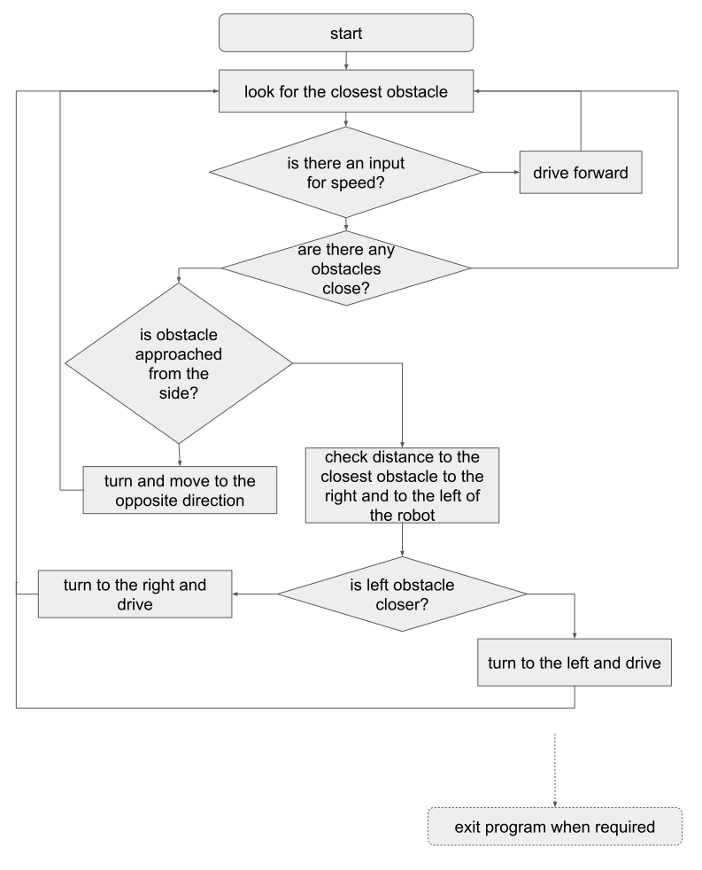

# RT1_Assignment2

C++ Robotics Simulator
================================
It's simple racer simulation based on ROS

Logic behind the solutino (flow chart)
--------------------------------------
NOTICE: In the flowchart - "yes" is always rightmost arrow, while "no" is always leftmost arrow with respect to the decision blocks

To run the program: in separate terminals do the following after catkin_make & roscore:

create the world
--------------------------------------
>>rosrun stage_ros stageros $(rospack find second_assignment)/world/my_world.world 

run publisher.cpp
--------------------------------------
>>rosrun second_assignment publisher.cpp

run subscriber.cpp
--------------------------------------
>>rosrun second_assignment subscriber.cpp
